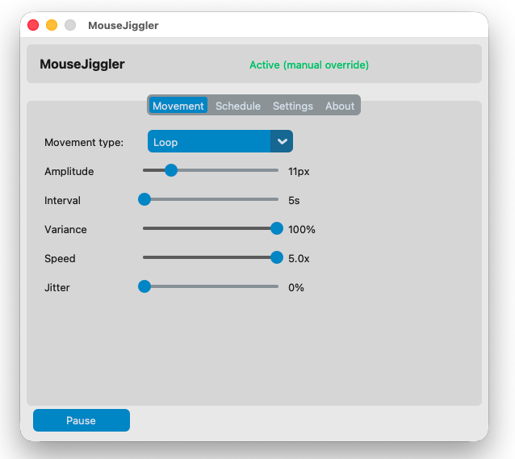
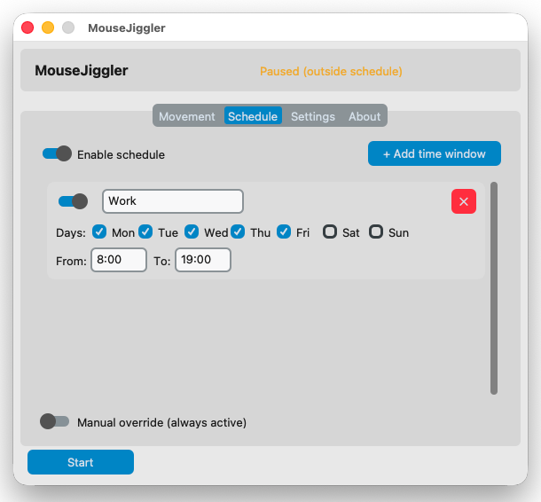
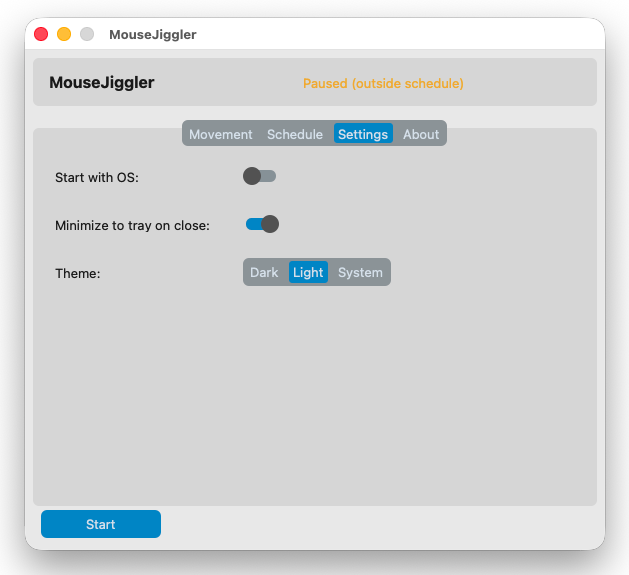
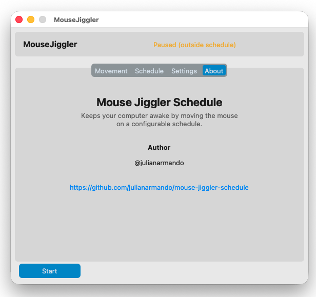

# Mouse Jiggler Schedule

A cross-platform (macOS + Windows) desktop app that keeps your computer awake by moving the mouse automatically — with full control over how, when, and on which days it runs.

Built with Python + CustomTkinter.

---

## Download

Pre-built binaries are available on the [Releases page](../../releases/latest):

| Platform | File |
|---|---|
| Windows | `MouseJigglerSchedule.exe` |
| macOS | `MouseJigglerSchedule-mac.zip` → extract and move `.app` to Applications |

---

## Screenshots

| Movement | Schedule |
|---|---|
|  |  |

| Settings | About |
|---|---|
|  |  |

---

## Features

- **Two movement modes**
  - **Loop** — smooth circular orbit, cursor always returns to its starting position
  - **Zen** — barely visible micro-movement (≤ 2px), for stealth use
- **Configurable parameters** — amplitude, interval, variance, speed, jitter
- **Schedule** — define time windows per day of the week; the jiggler activates and pauses automatically
- **Manual override** — force the jiggler active regardless of schedule
- **System tray** — always running in the background; icon color reflects current state
- **Dock icon** — mouse-shaped icon whose scroll wheel turns green (active), yellow (paused by schedule), or gray (stopped)
- **Start with OS** — optional login item (no admin required)
- **Minimize to tray on close** — keeps running when the window is closed
- **Theme support** — Dark, Light, or System

---

## Status indicators

| Color | Meaning |
|---|---|
| 🟢 Green | Active |
| 🟡 Yellow | Paused (outside scheduled hours) |
| ⚫ Gray | Stopped manually |

---

## Building from source

**Requirements:** Python 3.11+

On macOS, Tk support is required:
```bash
brew install python-tk@3.13
```

Clone and install dependencies:
```bash
git clone https://github.com/julianarmando/mouse-jiggler-schedule.git
cd mouse-jiggler-schedule
python3 -m venv .venv
source .venv/bin/activate   # Windows: .venv\Scripts\activate
pip install -r requirements.txt
```

Run:
```bash
python main.py
```

> **macOS note:** The app requires Accessibility permissions to move the mouse.  
> Go to **System Settings → Privacy & Security → Accessibility** and enable it.  
> A dialog will appear on first launch as a reminder.

### Package as a native app

**macOS** — run the build script from the project root:
```bash
./build_mac.sh
# Output: dist/MouseJigglerSchedule-mac.zip
```

**Windows** — triggered manually via GitHub Actions:
1. Push changes to `main`
2. Go to **Actions → Build → Run workflow**
3. Download `MouseJigglerSchedule.exe` from the Artifacts section

---

## How the schedule works

1. Add one or more time windows in the **Schedule** tab (days + from/to hours).
2. Enable the schedule toggle.
3. The app checks every 60 seconds — it starts automatically when inside a window and pauses when outside.
4. **Manual override** bypasses the schedule and keeps the jiggler always active.

---

## Movement parameters

| Parameter | Range | Description |
|---|---|---|
| Amplitude | 1–50 px | Size of the loop orbit (ignored by Zen mode) |
| Interval | 5–300 s | Wait time between movement cycles |
| Variance | 0–100% | Randomness applied to the interval |
| Speed | 0.1–5.0x | Animation speed per cycle |
| Jitter | 0–100% | Random pixel noise per step |

---

## Author

[@julianarmando](https://github.com/julianarmando) · [github.com/julianarmando/mouse-jiggler-schedule](https://github.com/julianarmando/mouse-jiggler-schedule)
